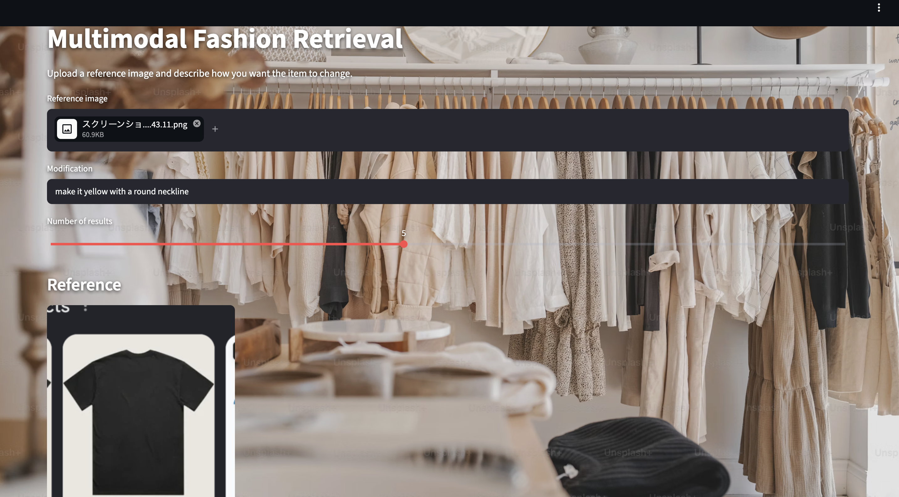
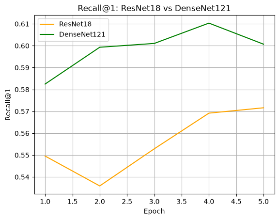
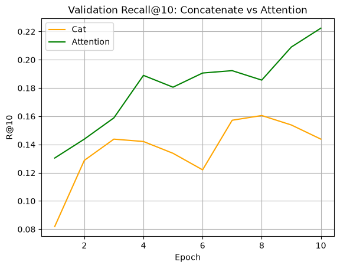
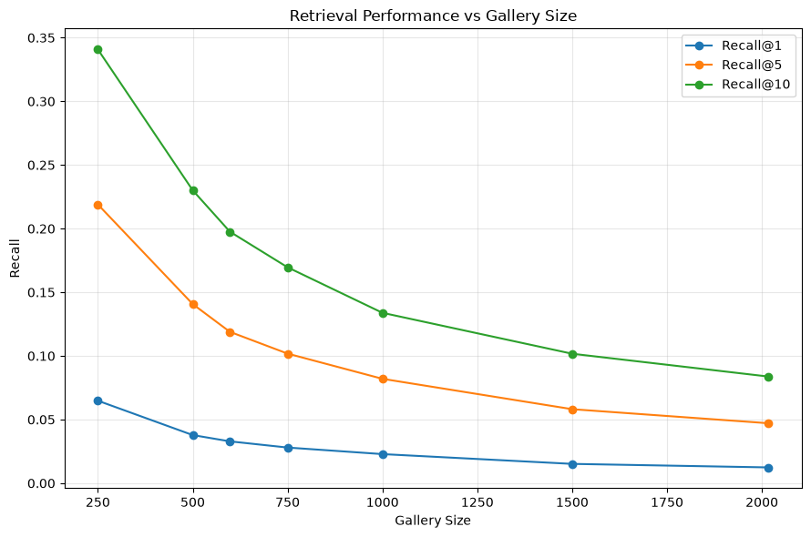

# Multimodal Fashion Retrieval System

An end-to-end multimodal fashion retrieval system that retrieves target fashion items from a **reference image + natural-language modification**.

The project covers metric-learning pretraining, multimodal fusion, controlled architecture comparison, retrieval analysis, ONNX export, API serving, containerization, and public deployment on Google Cloud Run.

[](https://fashion-retrieval-demo-384526995802.us-west1.run.app)
[](https://fashion-retrieval-api-384526995802.us-west1.run.app)
[](#deployment)
[](#onnx-export-and-validation)

## Live Demo

**Application:**  
https://fashion-retrieval-demo-384526995802.us-west1.run.app

**FastAPI backend:**  
https://fashion-retrieval-api-384526995802.us-west1.run.app

### Query Interface

[](https://fashion-retrieval-demo-384526995802.us-west1.run.app)

Upload a reference fashion image, describe the desired modification in natural language, and choose the number of retrieved results.

### Retrieval Results

[](https://fashion-retrieval-demo-384526995802.us-west1.run.app)

The application returns the highest-scoring catalog items together with their image IDs and similarity scores.

---

## Overview

The system solves a **composed image retrieval** task:

```text
Reference image
      +
Natural-language modification
      ↓
Multimodal query encoder
      ↓
256-D normalized embedding
      ↓
Similarity search against catalog embeddings
      ↓
Top-K fashion items
```

The research pipeline uses:

- **DenseNet121** for visual representation learning
- **DistilBERT** for natural-language encoding
- **Cross-attention** for multimodal fusion
- **InfoNCE-style contrastive learning** for multimodal retrieval
- **Recall@K** for retrieval evaluation
- **MLflow** for experiment tracking
- **ONNX Runtime** for optimized inference
- **FastAPI + Streamlit + Docker** for serving
- **Google Cloud Run + Artifact Registry** for public deployment

---

## System Architecture

```text
                         TRAINING / EXPERIMENTS
┌─────────────────────────────────────────────────────────────────────┐
│ Stanford Online Products                                           │
│          ↓                                                         │
│ DenseNet121 metric-learning pretraining                            │
│          ↓                                                         │
│ FashionIQ                                                          │
│          ↓                                                         │
│ Reference image ──┐                                                │
│                   ├── Cross-Attention Fusion ──> 256-D Query       │
│ Modification text ┘                                                │
│                                                                    │
│ Target image ──> DenseNet121 ──> 256-D Target Embedding            │
└─────────────────────────────────────────────────────────────────────┘


                           DEPLOYMENT
┌─────────────┐       HTTPS       ┌──────────────┐
│  Streamlit  │ ────────────────> │   FastAPI    │
│  Frontend   │                   │   Backend    │
└─────────────┘                   └──────┬───────┘
                                        │
                          ┌─────────────┴──────────────┐
                          │                            │
                     ONNX Encoder             Catalog Embeddings
                          │                            │
                          └─────────────┬──────────────┘
                                        ↓
                                  Top-K Retrieval
                                        ↓
                               Catalog Image Serving
```

> **Deployment note:** The notebook contains the latest controlled architecture experiments.  
> The public demo uses the previously validated deployment pipeline and deployment artifacts.

This separation keeps the experimental comparison reproducible while preserving a stable end-to-end application.

---

## Datasets

### Stanford Online Products (SOP)

Used to pretrain and compare image encoders with metric learning before multimodal training.

### FashionIQ

Used for composed image retrieval with:

- reference fashion image
- natural-language modification
- target fashion image

The deployed application serves a catalog of **10,385 fashion items**.

---

## Image Encoder Experiments

ResNet18 and DenseNet121 were compared on SOP before multimodal training.

### SOP Test Results

| Encoder / Sampling Strategy | Recall@1 | Recall@5 | Recall@10 |
|---|---:|---:|---:|
| ResNet18, standard negatives | 0.3956 | 0.5438 | 0.6076 |
| DenseNet121, standard negatives | 0.4429 | 0.5921 | 0.6528 |
| **DenseNet121, same-superclass hard negatives** | **0.4640** | **0.6108** | **0.6673** |

DenseNet121 with harder same-superclass negatives produced the strongest SOP test retrieval performance and was used as the visual foundation for the subsequent multimodal experiments.



---

## Multimodal Retrieval

Two fusion strategies were compared while keeping the pretrained visual and language backbones frozen during multimodal training.

### Concatenation Baseline

```text
Image embedding ──┐
                  ├── Concatenate ──> Fusion MLP ──> Query embedding
Text embedding ───┘
```

### Cross-Attention

```text
Visual tokens ───────────────┐
                             ├── Multi-Head Cross-Attention
Text representation ─────────┘
                                      ↓
                              Fused query embedding
```

### FashionIQ Test Results

| Fusion | Recall@1 | Recall@5 | Recall@10 |
|---|---:|---:|---:|
| Concatenation | 0.0079 | 0.0278 | 0.0506 |
| **Cross-Attention** | **0.0124** | **0.0471** | **0.0838** |

Cross-attention improved all three Recall@K metrics over the concatenation baseline.



---

## Retrieval Scalability

Retrieval was also evaluated under different candidate-gallery sizes.

| Gallery Size | Recall@1 | Recall@5 | Recall@10 |
|---:|---:|---:|---:|
| 250 | 0.0648 | 0.2190 | 0.3408 |
| 500 | 0.0378 | 0.1407 | 0.2301 |
| 598 | 0.0329 | 0.1189 | 0.1976 |
| 750 | 0.0280 | 0.1018 | 0.1696 |
| 1,000 | 0.0229 | 0.0820 | 0.1339 |
| 1,500 | 0.0152 | 0.0581 | 0.1017 |
| 2,017 | 0.0124 | 0.0471 | 0.0838 |

As expected, retrieval becomes more difficult as the candidate gallery grows.



---

## ONNX Export and Validation

The query encoder was exported to ONNX with dynamic batch and sequence dimensions.

PyTorch and ONNX outputs were checked numerically:

```text
Max absolute difference: 3.7252903e-07
Cosine similarity: 1.0
```

### Stable Deployment Benchmark

The deployed/stable model was benchmarked separately from the latest notebook experiment.

| Configuration | Device | R@1 | R@5 | R@10 | Query Latency (ms/sample) | Size (MB) |
|---|---|---:|---:|---:|---:|---:|
| PyTorch FP32 | CUDA | 0.0426 | 0.1373 | 0.2067 | 1.12 | 285.58 |
| PyTorch FP16 Mixed | CUDA | 0.0426 | 0.1363 | 0.2072 | 1.25 | 285.58 |
| PyTorch FP32 | CPU | 0.0426 | 0.1373 | 0.2053 | 16.89 | 285.57 |
| **ONNX Runtime FP32** | **CPU** | **0.0426** | **0.1373** | **0.2053** | **11.39** | **286.11** |
| PyTorch INT8 Dynamic | CPU | 0.0288 | 0.1101 | 0.1651 | 15.64 | 160.91 |

ONNX Runtime preserved the FP32 CPU retrieval metrics while reducing query latency from **16.89 ms to 11.39 ms per sample**, approximately a **32.6% reduction**.

Dynamic INT8 quantization reduced model size substantially, but with a measurable Recall@K drop, so the FP32 ONNX model remained the stronger quality/latency trade-off for deployment.

---

## Deployment

The public application is deployed as two independent Google Cloud Run services.

### Frontend

- **Streamlit**
- Public Google Cloud Run service
- Handles image upload, modification text, and result visualization
- Sends multimodal search requests to the FastAPI backend

### Backend

- **FastAPI**
- **ONNX Runtime** query inference
- Precomputed catalog embeddings
- Top-K similarity search
- Catalog image serving

### Cloud Infrastructure

```text
Google Artifact Registry
        │
        ├── fashion-api Docker image
        └── fashion-frontend Docker image
                    │
                    ↓
             Google Cloud Run
        ┌───────────┴────────────┐
        │                        │
  Streamlit Service       FastAPI Service
        │                        │
        └──────── HTTPS ─────────┘
```

The deployment bundles the required inference artifacts and **10,385 catalog images** into the backend container, avoiding a large FashionIQ download during first user access.

### Public Services

| Service | URL |
|---|---|
| Live Application | https://fashion-retrieval-demo-384526995802.us-west1.run.app |
| FastAPI Backend | https://fashion-retrieval-api-384526995802.us-west1.run.app |
| FastAPI Docs | https://fashion-retrieval-api-384526995802.us-west1.run.app/docs |

---

## Run Locally with Docker

### 1. Clone the repository

```bash
git clone https://github.com/DAI0915/multimodal-fashion-retrieval-system.git
cd multimodal-fashion-retrieval-system
```

### 2. Add deployment artifacts

Large model and catalog artifacts are intentionally excluded from Git because of file-size constraints.

Expected local structure:

```text
artifacts/
├── query_encoder_dynamic.onnx
├── catalog_embeddings.npy
├── catalog_ids.json
├── catalog_images/
└── tokenizer/
```

### 3. Start the application

```bash
docker compose up --build
```

Open the frontend:

```text
http://localhost:8501
```

FastAPI backend:

```text
http://localhost:8000
```

Interactive FastAPI documentation:

```text
http://localhost:8000/docs
```

---

## Training Environment

Create a Python environment:

```bash
conda create -n multimodal-retrieval python=3.11 -y
conda activate multimodal-retrieval
```

Install training dependencies:

```bash
pip install -r requirements-training.txt
```

The main experiment notebook is:

```text
notebooks/multimodal_retrieval_pipeline.ipynb
```

---

## Project Structure

```text
multimodal-fashion-retrieval-system/
├── app/
│   ├── __init__.py
│   ├── main.py
│   ├── inference.py
│   ├── retrieval.py
│   └── catalog_images.py
│
├── frontend/
│   └── streamlit_app.py
│
├── artifacts/
│   ├── catalog_ids.json
│   ├── tokenizer/
│   ├── query_encoder_dynamic.onnx      # excluded from Git
│   ├── catalog_embeddings.npy          # excluded from Git
│   └── catalog_images/                 # excluded from Git if large
│
├── assets/
│   └── background.jpg
│
├── docs/
│   └── images/
│       ├── app_input.png
│       └── app_results.png
│
├── figures/
│   ├── sop_recall_at_1.png
│   ├── multimodal_recall_at_10.png
│   └── gallery_size_vs_recall.png
│
├── notebooks/
│   └── multimodal_retrieval_pipeline.ipynb
│
├── Dockerfile.api
├── Dockerfile.frontend
├── docker-compose.yml
├── requirements-api.txt
├── requirements-training.txt
├── .gitignore
└── README.md
```

---

## Tech Stack

### Machine Learning

- Python
- PyTorch
- torchvision
- Hugging Face Transformers
- DenseNet121
- DistilBERT
- MLflow

### Retrieval and Optimization

- Metric learning
- Hard-negative sampling
- Cross-attention
- Contrastive learning
- Recall@K
- ONNX
- ONNX Runtime
- Dynamic INT8 quantization

### Application and Deployment

- FastAPI
- Streamlit
- Docker
- Docker Compose
- Google Cloud Run
- Google Artifact Registry

---

## Key Takeaways

This project covers the full lifecycle of a multimodal retrieval system:

1. Comparing visual encoders with metric learning
2. Applying hard-negative sampling
3. Designing controlled multimodal fusion experiments
4. Comparing concatenation and cross-attention
5. Evaluating retrieval under increasing gallery sizes
6. Validating PyTorch-to-ONNX numerical parity
7. Benchmarking latency, model-size, and retrieval-quality trade-offs
8. Serving inference through FastAPI
9. Building an interactive Streamlit frontend
10. Containerizing the system with Docker
11. Deploying the complete application publicly on Google Cloud Run

---

## Author

**Dai Fujimoto**  
M.S. Computer Science (Artificial Intelligence)  
University of Southern California